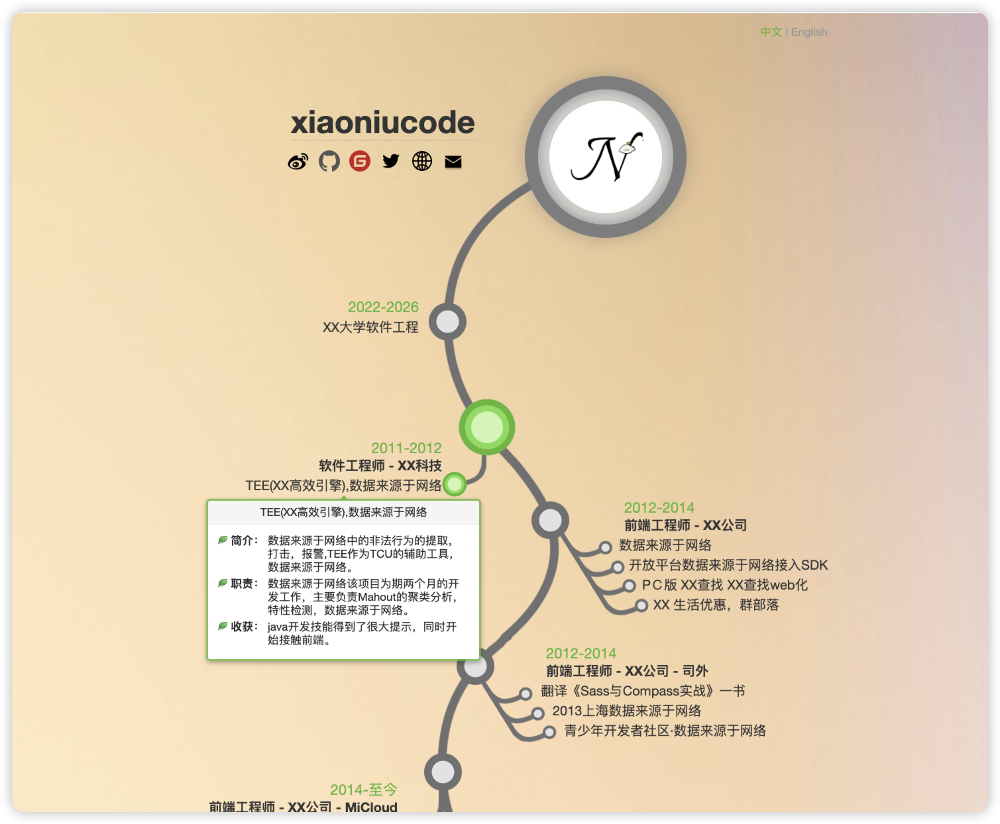
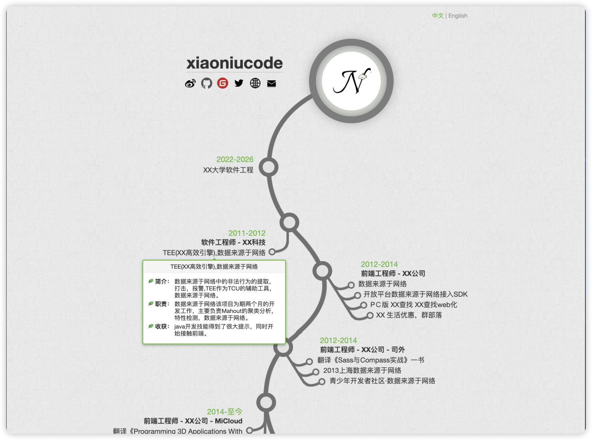
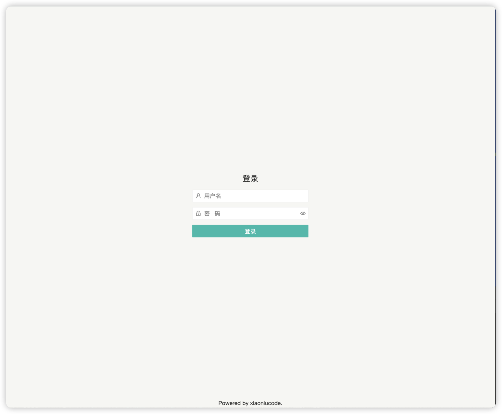
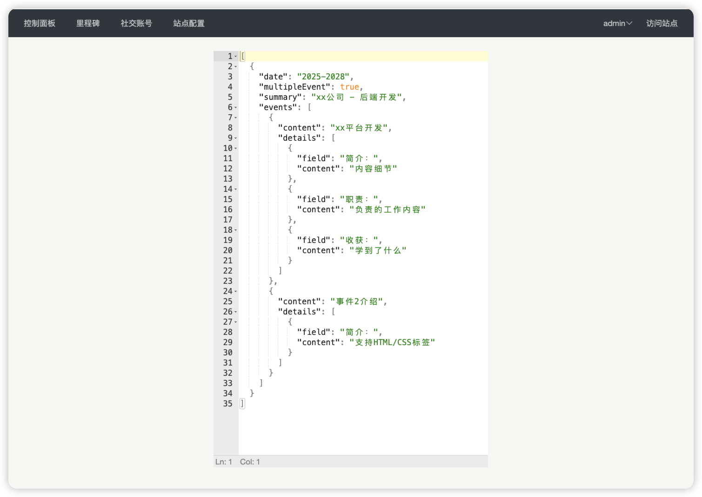
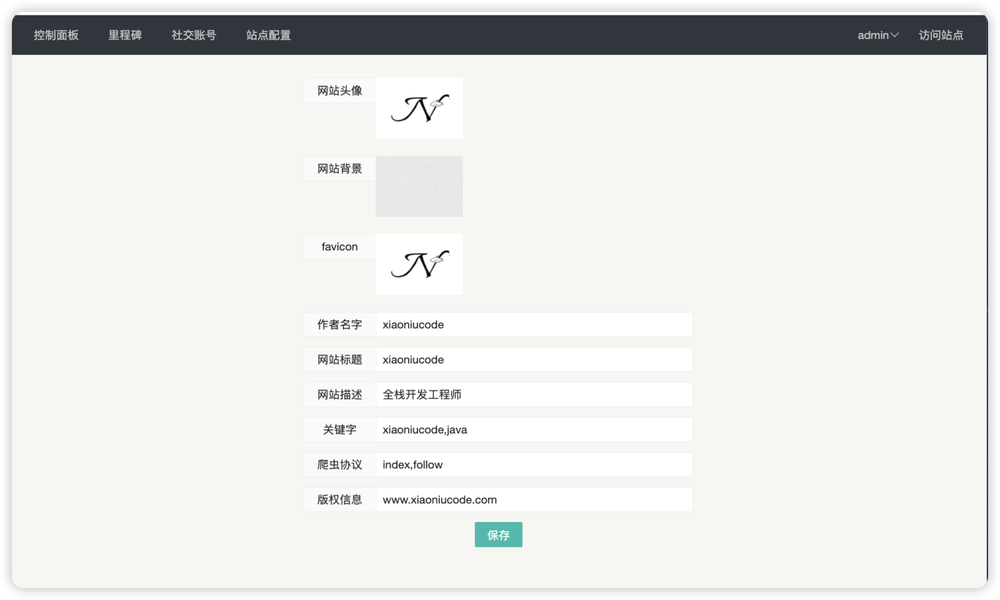
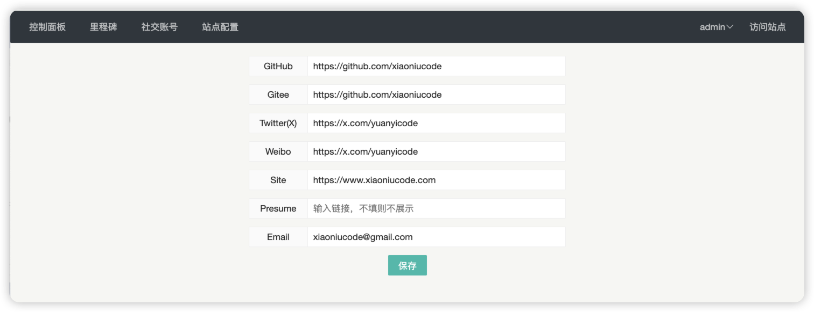

<p align="center" style="font-size:18px;color:#555;margin-top:-10px;margin-bottom:24px;">
TimeLine-Trail
</p>
<div align="center">

  <a href="https://github.com/xiaoniucode/timeline-trail/stargazers">
    
  </a>

  <a href="https://github.com/xiaoniucode/timeline-trail/forks">
    
  </a>

  <a href="https://github.com/xiaoniucode/timeline-trail/releases/v0.1.0">
    
  </a>

  <a href="https://somsubhra.github.io/github-release-stats/?username=xiaoniucode&repository=timeline-trail">
    
  </a>

</div>

<div align="center">
  <a href="README.md"><strong>README</strong></a> &nbsp;|&nbsp;
  <a href="README_ZH.md"><strong>中文文档</strong></a> &nbsp;|&nbsp;
</div>

## ✨ 介绍

**Timeline Trail**
是一个特别的个人履历可视化展示网站。与传统简历不同，它采用时间线与树状轨迹相结合的方式，将分散的经历点连接成清晰的成长路径。每个职业节点、教育经历和重要里程碑都以节点形式呈现，展现它们之间的关联与演进逻辑，更易于理解。

<div align="center">

</div>

## 🚀 快速开始

镜像已打包到`docker-hub`公共仓库，在具备`docker`环境的服务器上直接运行如下命令即可安装。

```shell
sudo mkdir -p /root/timeline-trail/uploads
docker run -d \
  --name timelinetrail \
  -p 8080:8080 \
  -v /root/timeline-trail/uploads:/root/timeline_trail/upload \
  xiaoniucode/timeline-trail:latest
```

后台登录地址：`http://localhost:8080/admin/login`

默认登录用户名密码是：`admin`：`123456`

## 🎨 项目截图

<div align="center">

<table>
  <tr>
    <td align="center">
      <br>
      <strong>首页</strong>
    </td>
    <td align="center">
      <br>
      <strong>登录页面</strong>
    </td>
  </tr>
  <tr>
    <td align="center">
      <br>
      <strong>控制面板</strong>
    </td>
    <td align="center">
      <br>
      <strong>配置页面</strong>
    </td>
  </tr>
  <tr>
    <td align="center">
      <br>
      <strong>社交功能</strong>
    </td>
    <td align="center">
      <br>
      <strong>里程碑管理</strong>
    </td>
  </tr>
</table>

</div>

## 技术栈

| 层级 | 技术              | 用途           |
|------|-----------------|--------------|
| **后端** | Java 8          | 主要编程语言       |
| | Spring Boot 2.x | 应用框架         |
| | JPA (Hibernate) | 数据持久层        |
| | H2 Database     | 嵌入式数据库       |
| | Freemarker      | 服务端模板引擎      |
| **前端** | LayUI           | UI 组件库       |
| | jQuery          | DOM 操作与 AJAX |
| | CSS Sprite      | 图片优化技术       |
| | jsoneditor      | json文本编辑     |

## 问题反馈

反馈问题:[issues](https://github.com/xiaoniucode/timeline-trail/issues)

## 📈 项目趋势

<p align="center">
  <a href="https://github.com/xiaoniucode/timeline-trail/stargazers">
    
  </a>
</p>

## 🙏致谢
- 首页设计灵感来自materliu
- jetbrains IDEA开发工具
